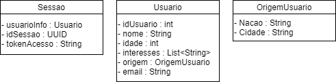
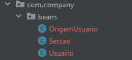
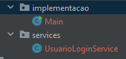
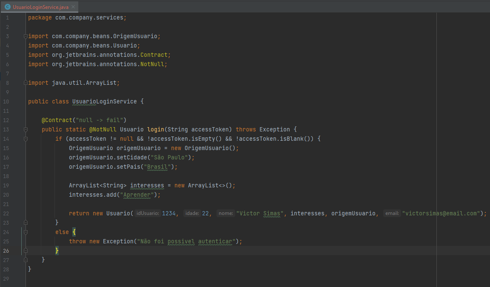
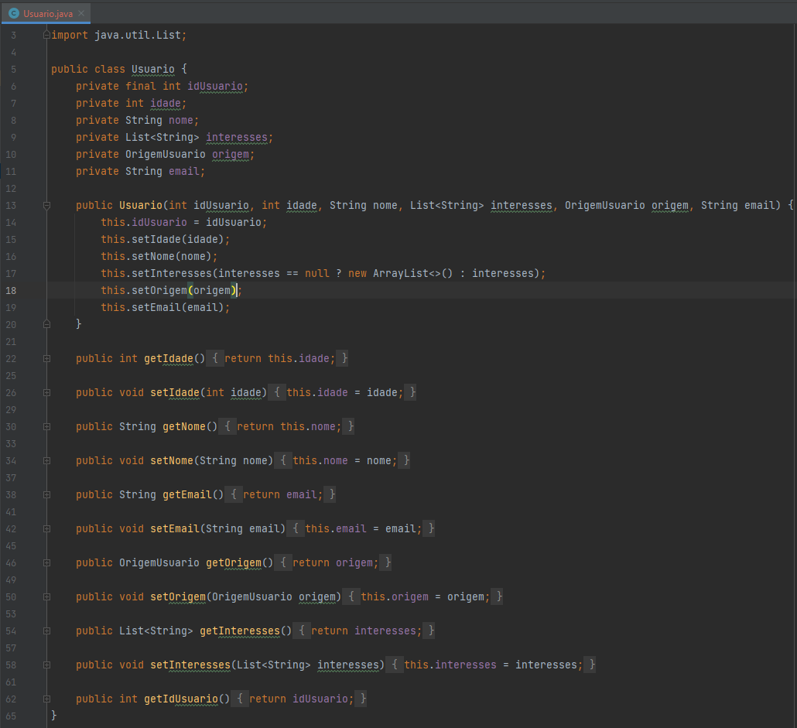
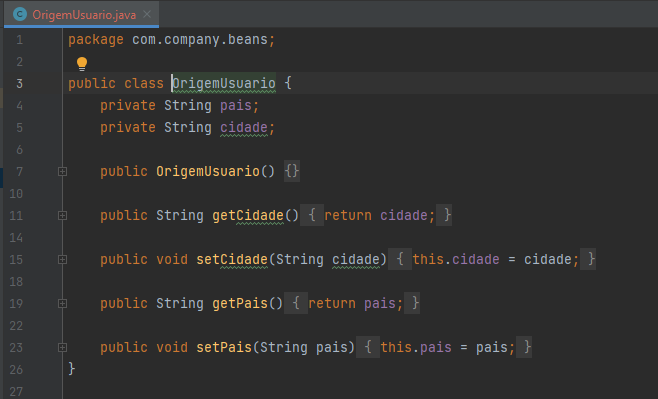
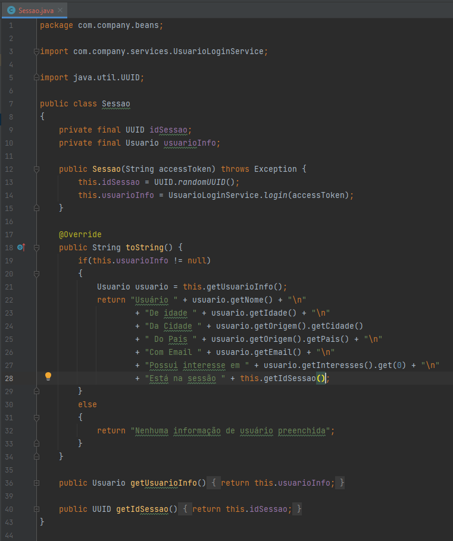
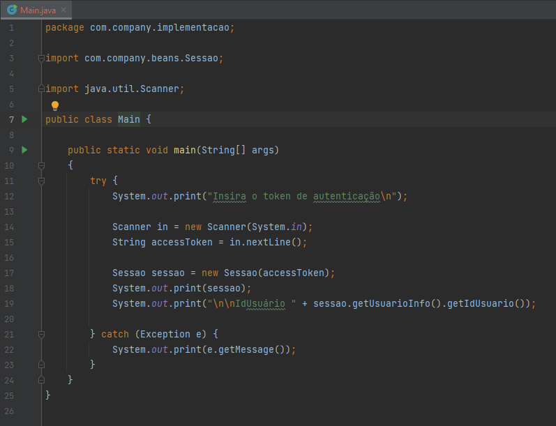

# Getters and Setters - FIAP - Fase 5

## Atividade 1 - Capítulo 2

### Diagrama de Classes
O diagrama retrata os objetos utilizados na area de login do site Gulliver Traveller, tratando-se das informações de sessão e do usuário.

### Classes Modelos - Beans

Representações dos objetos descritos no diagrama.

### Classes de Serviço

A implementação e a classe de login, a que irá preencher as informações do usuário.

### Descrição e Justificativa da solução.

Mockando uma funcionalidade de login, além das classes que possibilitam esse fluxo, foi necessário criar uma outra classe para simular uma situação de login, a qual põe a teste o uso do construtor da classe Usuario.

A classe Usuario possui todas as suas propriedades privadas, porém, apenas uma é constante e só tem seu valor agregado qnd sua instância é gerada, o idUsuario, isso é para que em nenhum momento do código esse campo seja alterado.

A propriedade origem é descrita pela classe OrigemUsuario.

A sessao do usuário é a visão completa em tempo de acesso, e ela, também precisou limitar a edição dos seus campos, se tratando de uma sessão real, a qual não pode ser mais alterada assim que gerada.

Por ultimo, a classe que possibilita testar o fluxo, a Main, com dois cenários possiveis no término de sua execução. Se o AccessToken for preenchido, o usuário Victor Simas será Logado, se não, não será possivel fazer o login.

