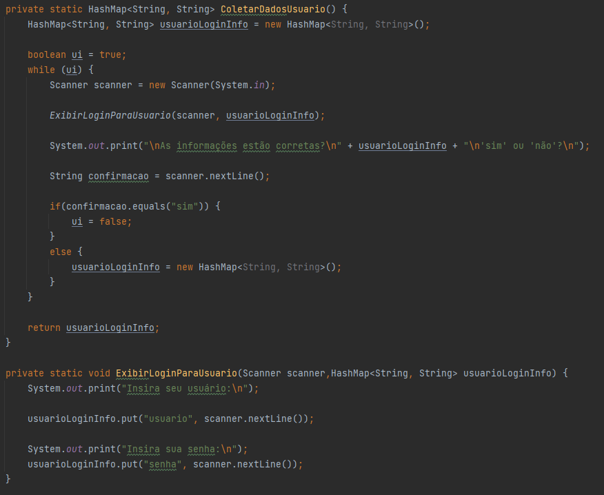
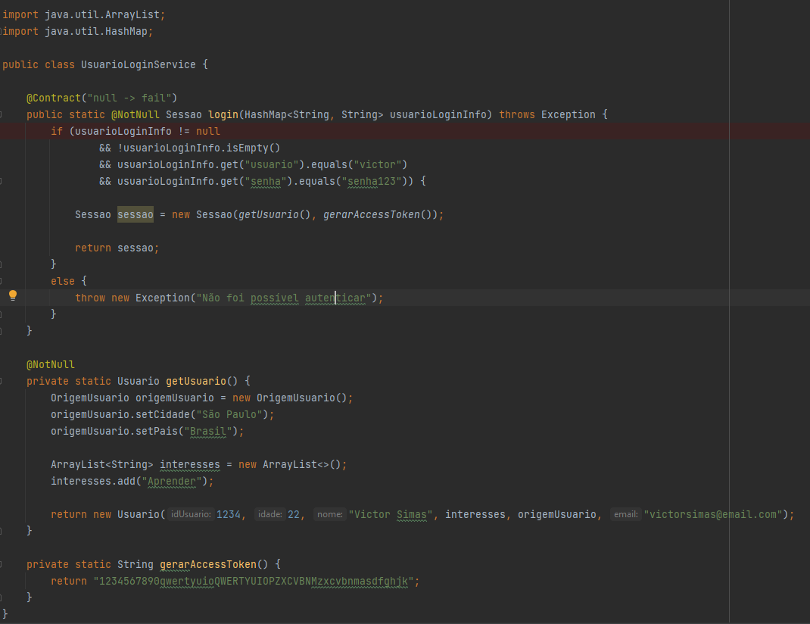

# Collections - FIAP - Fase 5

## Atividade 2 - Capítulo 5

###  Identificação/justificativa das necessidades das coleções

No contrato de login, foi utilizado o tipo de coleção HashMap para gerar um contrato em execução do usuário, o qual irá receber as suas informações de login, nome de usuário e senha. 

### Implementação das coleções && Tratamento dos dado

Temos dois tipos de coleções apresentadas nessa classe, temos o uso da coleção HashMap, referente aos dados de login e a List, referente a lista de interesses do usuário.

